# ActionableMessages PowerShell Module

## Overview

The ActionableMessages PowerShell module provides a streamlined approach to creating interactive Adaptive Cards for use in Outlook and Microsoft 365 applications. Using this module, you can easily build rich, interactive content that allows recipients to take action directly from within their email client.

## Installation

### From PowerShell Gallery

```powershell
Install-Module -Name ActionableMessages -Scope CurrentUser
```

### Manual Installation

1. Download the module from the repository
2. Extract to a directory in your PowerShell module path:

```powershell
$modulePath = "$env:USERPROFILE\Documents\PowerShell\Modules\ActionableMessages"
New-Item -Path $modulePath -ItemType Directory -Force
Copy-Item -Path "path\to\extracted\module\*" -Destination $modulePath -Recurse
```

3. Import the module:

```powershell
Import-Module ActionableMessages
```

## Key Concepts

### Actionable Messages

Actionable Messages add interactive capabilities to emails, allowing recipients to take actions without leaving their inbox. These actions can include opening URLs, submitting data, or triggering server-side processes.

## Basic Usage

### Creating a Simple Notification Card

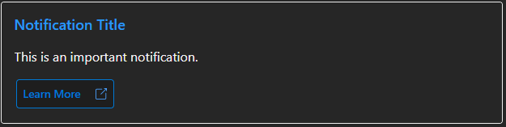

```powershell
# Import the module
Import-Module ActionableMessages

# Create a new card
$card = New-AMCard -OriginatorId "your-originator-id"

# Add a title
$title = New-AMTextBlock -Text "Notification Title" -Size "Large" -Weight "Bolder" -Color "Accent"
Add-AMElement -Card $card -Element $title

# Add content
$message = New-AMTextBlock -Text "This is an important notification." -Wrap $true
Add-AMElement -Card $card -Element $message

# Add an action button
$action = New-AMOpenUrlAction -Title "Learn More" -Url "https://mynster9361.github.io/posts/ActionableMessagesModuleWhatsNew/"
$actionSet = New-AMActionSet -Id "actions" -Actions @($action)
Add-AMElement -Card $card -Element $actionSet

# Export the card for email
$emailParams = Export-AMCardForEmail -Card $card -Subject "Important Notification" -ToRecipients "user@example.com"
```

## Advanced Examples

Here are some additional prebuilt cards for more specific use cases. These examples demonstrate the flexibility of the module for creating interactive emails.

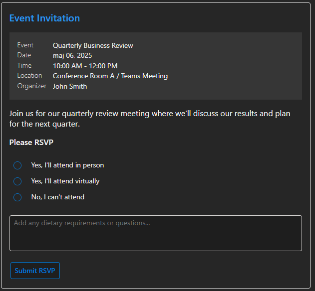

### Event Invitation Card

```powershell
# Create a new card
$card = New-AMCard -OriginatorId "your-originator-id"

# Add event title
$title = New-AMTextBlock -Text "Event Invitation" -Size "ExtraLarge" -Weight "Bolder" -Color "Accent"
Add-AMElement -Card $card -Element $title

# Add event details
$eventFacts = @(
    New-AMFact -Title "Event" -Value "Quarterly Business Review"
    New-AMFact -Title "Date" -Value "$((Get-Date).AddDays(7).ToString('MMMM dd, yyyy'))"
    New-AMFact -Title "Time" -Value "10:00 AM - 12:00 PM"
    New-AMFact -Title "Location" -Value "Conference Room A / Teams Meeting"
    New-AMFact -Title "Organizer" -Value "John Smith"
)
$factSet = New-AMFactSet -Facts $eventFacts
Add-AMElement -Card $card -Element $factSet

# Add RSVP options
$attendanceChoices = @(
    New-AMChoice -Title "Yes, I'll attend in person" -Value "in-person"
    New-AMChoice -Title "Yes, I'll attend virtually" -Value "virtual"
    New-AMChoice -Title "No, I can't attend" -Value "decline"
)
$attendanceInput = New-AMChoiceSetInput -Id "attendance" -Label "Will you attend?" -Choices $attendanceChoices -Style "expanded"
Add-AMElement -Card $card -Element $attendanceInput

# Add submit button
$submitAction = New-AMExecuteAction -Title "Submit RSVP" -Verb "POST" -Url "https://api.example.com/rsvp" -Body '{"response": "{{attendance.value}}"}'
$actionSet = New-AMActionSet -Actions @($submitAction)
Add-AMElement -Card $card -Element $actionSet

# Export the card for email
$emailParams = Export-AMCardForEmail -Card $card -Subject "Event Invitation" -ToRecipients "user@example.com"

```

### Disk Space Alert Card

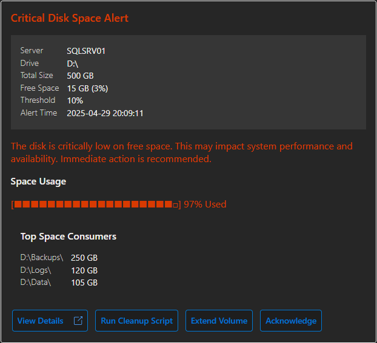

```powershell
# Create a new card
$card = New-AMCard -OriginatorId "your-originator-id"

# Add header
$header = New-AMTextBlock -Text "Critical Disk Space Alert" -Size "Large" -Weight "Bolder" -Color "Attention"
Add-AMElement -Card $card -Element $header

# Add server details
$serverFacts = @(
    New-AMFact -Title "Server" -Value "SQLSRV01"
    New-AMFact -Title "Drive" -Value "D:\"
    New-AMFact -Title "Free Space" -Value "15 GB (3%)"
    New-AMFact -Title "Threshold" -Value "10%"
)
$factSet = New-AMFactSet -Facts $serverFacts
Add-AMElement -Card $card -Element $factSet

# Add action buttons
$cleanupAction = New-AMExecuteAction -Title "Run Cleanup Script" -Verb "POST" -Url "https://api.example.com/cleanup"
$acknowledgeAction = New-AMExecuteAction -Title "Acknowledge" -Verb "POST" -Url "https://api.example.com/acknowledge"
$actionSet = New-AMActionSet -Actions @($cleanupAction, $acknowledgeAction)
Add-AMElement -Card $card -Element $actionSet

# Export the card for email
$emailParams = Export-AMCardForEmail -Card $card -Subject "Disk Space Alert" -ToRecipients "admin@example.com"
```

## Wan to see more examples of the new prebuilt cards?

Check out this blog post:

[Prebuilt Cards](https://mynster9361.github.io/posts/ActionableMessagesModuleWhatsNew/)

Just to give a couple of examples:

`New-AMApprovalCard`

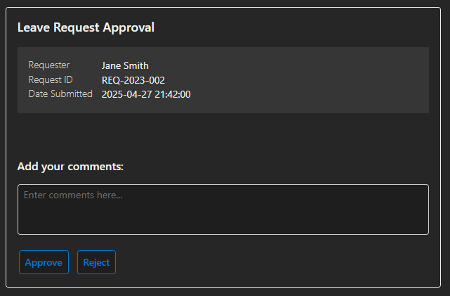

`New-AMNotificationCard`

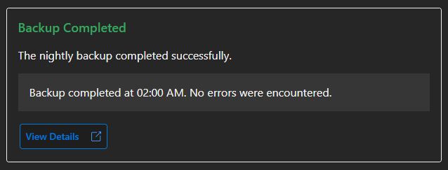

`New-AMDiskSpaceAlertCard`

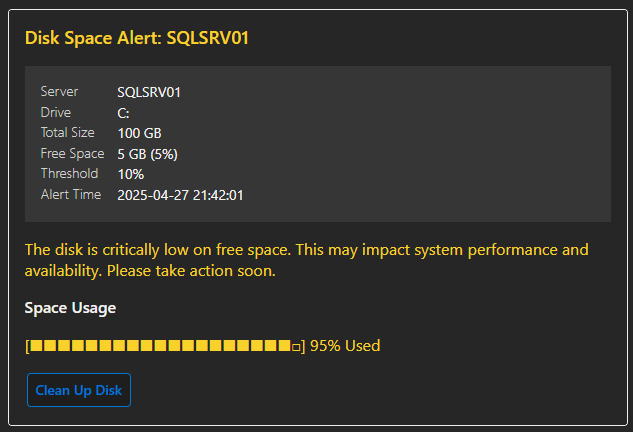

`New-AMServerMonitoringCard`

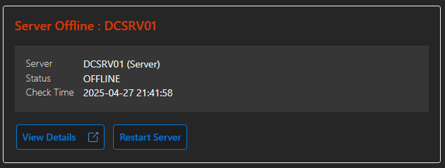

`New-AMServiceAlertCard`

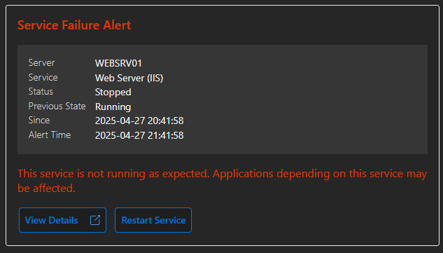

`New-AMITResourceRequestCard`

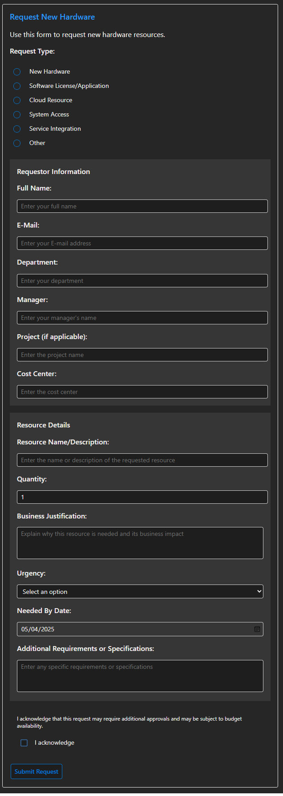

`New-AMApplicationUsageSurveyCard`

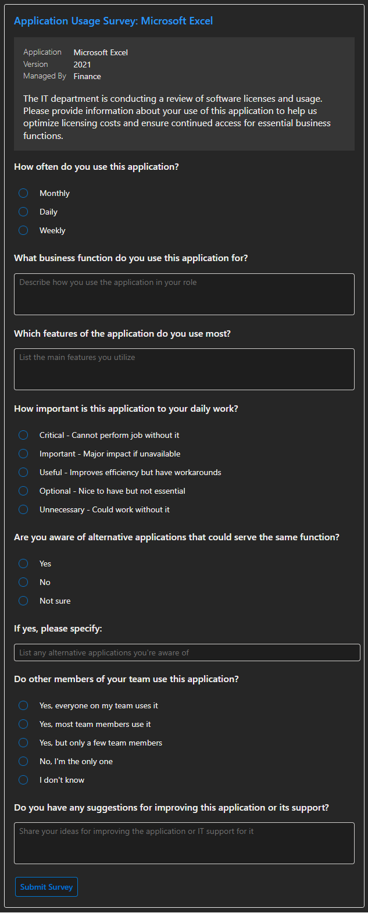

`New-AMServerPurposeSurveyCard`

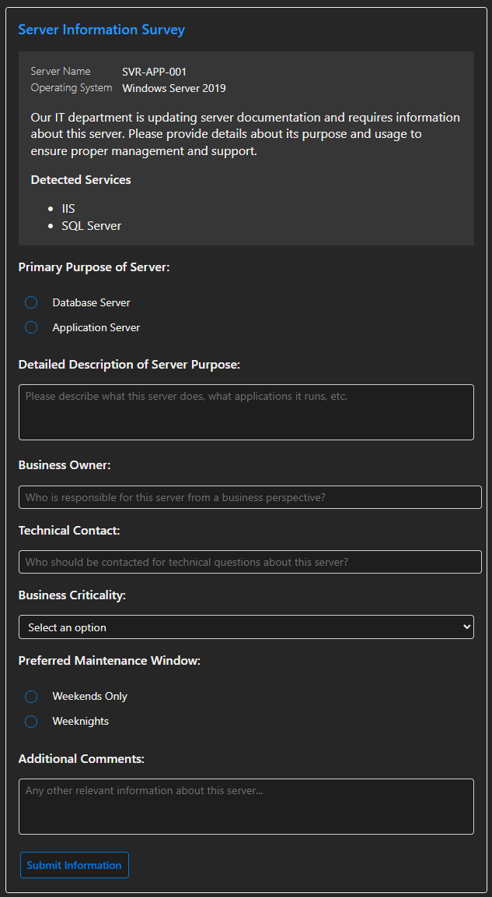

## Module Structure

The module is organized into logical function categories:

- **Core**: Functions for card creation, manipulation, and export
- **Elements**: Visual components like text, images, containers, etc.
- **Actions**: Interactive components like buttons and links
- **Inputs**: Form elements for collecting user input
- **Prebuilt**: Ready-to-use Adaptive Cards for common scenarios.

## Function Reference

### Core Functions

| Function                | Description                            |
| ----------------------- | -------------------------------------- |
| `New-AMCard`            | Creates a new Adaptive Card            |
| `Add-AMElement`         | Adds an element to a card or container |
| `Export-AMCard`         | Exports a card as JSON                 |
| `Export-AMCardForEmail` | Prepares a card for email delivery     |

### Element Functions

| Function          | Description                               |
| ----------------- | ----------------------------------------- |
| `New-AMTextBlock` | Creates text content                      |
| `New-AMImage`     | Adds an image                             |
| `New-AMImageSet`  | Creates a collection of images            |
| `New-AMContainer` | Groups elements together                  |
| `New-AMColumnSet` | Creates a multi-column layout             |
| `New-AMColumn`    | Defines a column within a ColumnSet       |
| `New-AMFactSet`   | Creates a list of facts (key-value pairs) |
| `New-AMFact`      | Creates a single fact (key-value pair)    |
| `New-AMActionSet` | Groups actions together                   |

### Action Functions

| Function                       | Description                                |
| ------------------------------ | ------------------------------------------ |
| `New-AMOpenUrlAction`          | Creates a button that opens a URL          |
| `New-AMExecuteAction`          | Creates a button that calls an API         |
| `New-AMShowCardAction`         | Creates a button that reveals another card |
| `New-AMToggleVisibilityAction` | Creates a button that shows/hides elements |

### Input Functions

| Function               | Description                              |
| ---------------------- | ---------------------------------------- |
| `New-AMTextInput`      | Creates a text field                     |
| `New-AMNumberInput`    | Creates a numeric input field            |
| `New-AMDateInput`      | Creates a date picker                    |
| `New-AMTimeInput`      | Creates a time picker                    |
| `New-AMToggleInput`    | Creates a checkbox/toggle switch         |
| `New-AMChoiceSetInput` | Creates a dropdown or radio button group |
| `New-AMChoice`         | Creates an option for a ChoiceSetInput   |

### Prebuilt Functions

| Function                           | Description                                  |
| ---------------------------------- | -------------------------------------------- |
| `New-AMAccountVerificationCard`    | Creates a card for account verification      |
| `New-AMApprovalCard`               | Creates a card for approval workflows        |
| `New-AMITResourceRequestCard`      | Creates a card for IT resource requests      |
| `New-AMNotificationCard`           | Creates a card for system notifications      |
| `New-AMServiceAlertCard`           | Creates a card for service alerts            |
| `New-AMServerMonitoringCard`       | Creates a card for server monitoring         |
| `New-AMFeedbackFormCard`           | Creates a card for collecting feedback       |
| `New-AMDiskSpaceAlertCard`         | Creates a card for disk space alerts         |
| `New-AMApplicationUsageSurveyCard` | Creates a card for application usage surveys |

## Examples

### Approval Workflow Card

```powershell
# Create approval card
$card = New-AMApprovalCard -OriginatorId "leave-approval-system" -Title "Leave Request Approval" `
    -RequestID "REQ-2023-002" -Requester "Jane Smith" `
    -Description "Approval is required for a leave request from Jane Smith." `
    -ApproveUrl "https://api.example.com/approve" -RejectUrl "https://api.example.com/reject"

# Export the card for email
Export-AMCardForEmail -Card $card -Subject "Leave Request Approval" -ToRecipients "manager@example.com"
```

### Feedback Form Card

```powershell
# Create feedback form card
$card = New-AMFeedbackFormCard -Title "Customer Feedback" `
    -ResponseEndpoint "https://api.example.com/feedback"

# Export the card for email
Export-AMCardForEmail -Card $card -Subject "We Value Your Feedback" -ToRecipients "feedback@example.com"
```

## Best Practices

### Security

- Register your originator ID with Microsoft before deploying to production (https://aka.ms/publishactionableemails)

### Design Considerations

- Keep cards focused on a single task or piece of information
- Use clear, concise language for buttons and instructions
- Test your cards in different Outlook clients (desktop, web, mobile)
- Provide fallback text for email clients that don't support Adaptive Cards

### Performance

- Use the `-Compress` parameter with `Export-AMCard` for production deployments
- Keep image sizes small to ensure quick loading

### Accessibility

- Always include alt text for images
- Use appropriate color contrast
- Ensure all interactive elements have clear labels

## Registering Your Originator ID

Before using Actionable Messages in production, you must register your originator ID with Microsoft:

1. Go to the Actionable Email Developer Dashboard
2. Sign in with your Microsoft account
3. Register a new sender by providing the required information
4. Use the provided originator ID in your cards

## Additional Resources

- [Actionable Messages Documentation](https://mynster9361.github.io/modules/actionablemessages/)
- [Adaptive Cards Documentation](https://adaptivecards.io/)
- [Outlook Actionable Messages Documentation](https://learn.microsoft.com/en-us/outlook/actionable-messages/)
- [Adaptive Cards Designer](https://adaptivecards.io/designer/)

## Blog posts

- [Prebuilt Cards](https://mynster9361.github.io/posts/ActionableMessagesModuleWhatsNew/)
- [Building Interactive Emails](https://mynster9361.github.io/posts/ActionableMessagesModule/)
- [Sending Actionable Messages without this module](https://mynster9361.github.io/posts/ActionableMessages/)

## License

This module is licensed under the MIT License. See the LICENSE file for details.
